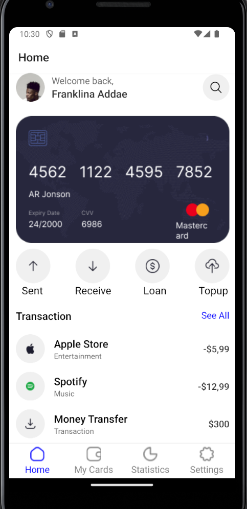
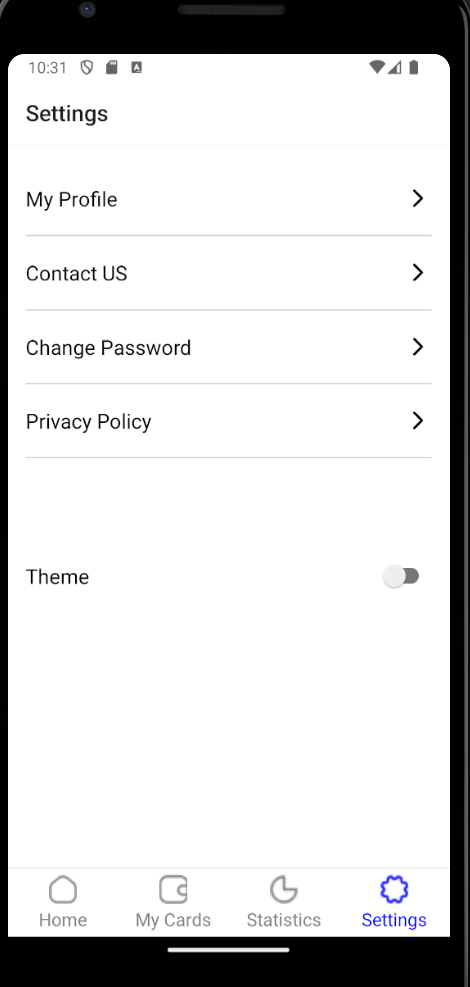
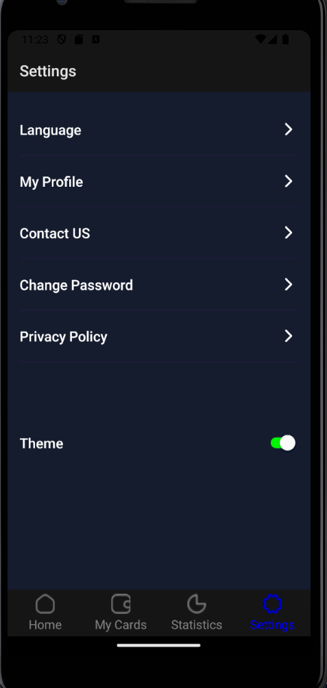

# rn-Assignment5-11262526

MyBankingApp

MyBankingApp is a financial management UI application built with React Native. The app allows users to track transactions, manage cards, view statistics, and adjust settings, including enabling a dark mode theme. The app features intuitive navigation through a bottom tab bar and provides a seamless user experience with visually appealing icons and responsive design.

## Features

- *Home Screen*: Displays a welcome message, recent transactions, and quick action items for sending, receiving, loans, and top-ups.
- *My Cards Screen: Manages user cards *Blank Page For Now.
- *Statistics Screen: Provides detailed statistics on user transactions. *Blank Page For Now..
- *Settings Screen*: Allows users to toggle between light and dark modes and others.
- *Dark Mode*: All screens and elements adapt to a dark theme, improving usability in low-light environments.

## Screenshots

### Home Screen
LightMode



### Settings Screen
LightMode



### Settings Screen
DarkMode



DarkMode


### My Cards Screen
### BLANK PAGE FOR NOW

### Statistics Screen
### BLANK PAGE FOR NOW
## Installation

1. *Clone the repository*
   bash
   git clone https://github.com/yourusername/MyFinanceApp.git

## Installation 
1. **Clone the repository** bash git clone https://github.com/yourusername/MyFinanceApp.git  
2. **Navigate to the project directory** bash cd MyFinanceApp  
3. **Install dependencies** bash npm install  
4. **Start the application** bash npm start 

## Built With - **React Native**: 
A framework for building native apps using React. - **React Navigation**: For routing and navigation in the app. - **Context API**: For managing global state, including theme settings.

## Usage ### Home Screen - 
**Welcome Message**: Personalized greeting for the user. - **Profile Picture**: Displays user's profile picture. - **Transaction List**: Displays recent transactions with category icons. - **Quick Actions**: Buttons for sending money, receiving money, loans, and top-ups.

### Settings Screen - 
**Theme Toggle**: Switch between light and dark modes.

## Contributing 
1. **Fork the repository** 
2. **Create a new branch** bash git checkout -b feature/your-feature-name  
3. **Commit your changes** bash git commit -m "Add your commit message here"  
4. **Push to the branch** bash git push origin feature/your-feature-name ``` 
5. *Open a pull request*
